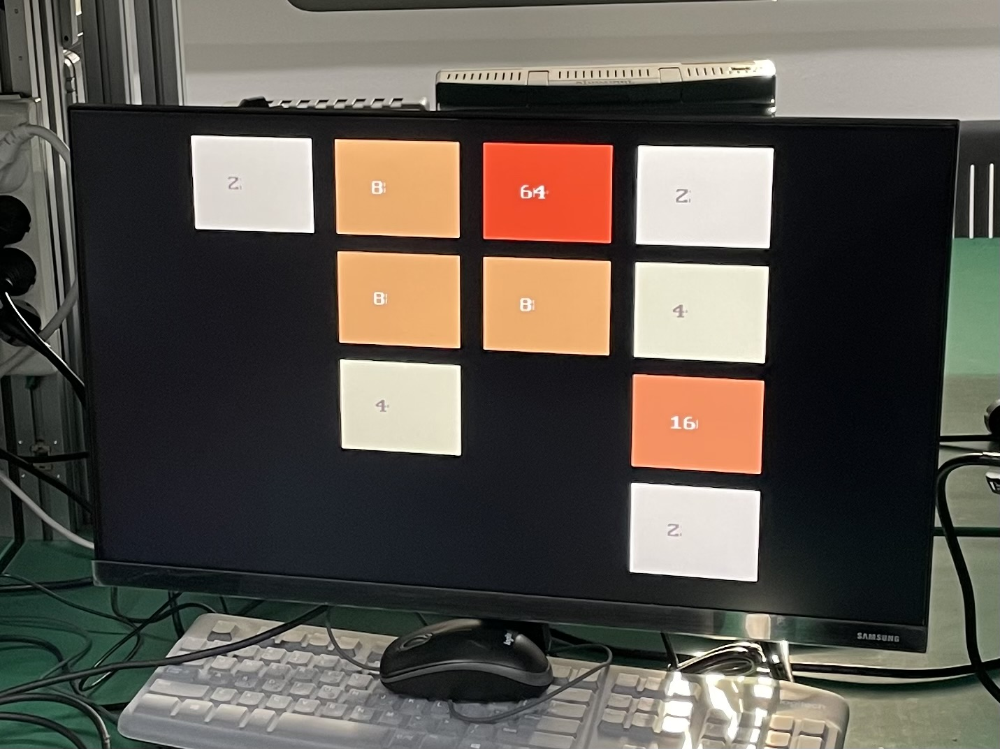

# Implementation 2048 Game on FPGA

> ICE2004 Final project code
## Spec

- **FPGA**: Xilinx Artix-7 XC7A75T-1FGG484C
- **Screen output resolution**: D-SUB, 1280 x 720
- LCD Score output
- Trigger sound when you move board

## Photos

